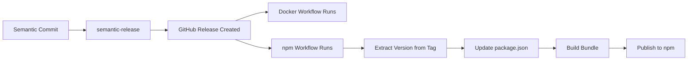

# MCP Server Publishing Workflow

This document explains how the MCP server is published to npm, both automatically and manually.

## Publishing Methods

### Automatic Publishing (Recommended)

The MCP server is **automatically published to npm** when semantic-release creates a GitHub release:

1. You push a semantic commit to `main` (e.g., `fix: bug` or `feat: new feature`)
2. Semantic-release runs and creates a GitHub release with a version tag (e.g., `v1.2.3`)
3. The Docker workflow builds and pushes images
4. **The npm workflow automatically triggers** and publishes `@cronicorn/mcp-server` to npm

**No manual intervention needed!** The workflow:
- Extracts the version from the release tag
- Updates `package.json` to match
- Publishes to npm with `latest` tag (or `beta` if marked as prerelease)
- Adds deployment summary to the workflow run

### Manual Publishing (Override)

You can also manually trigger a publish via GitHub Actions:

1. Go to repository **Actions** tab
2. Select **"Publish MCP Server to npm"** workflow
3. Click **"Run workflow"** dropdown
4. Configure:
   - **version_bump**: patch, minor, or major
   - **npm_tag**: latest, beta, next, etc.
5. Click **"Run workflow"**

This method:
- Bumps the version in `package.json`
- Commits and pushes the version bump
- Creates a git tag (`mcp-server-v{version}`)
- Creates a GitHub release
- Publishes to npm

## Prerequisites

### 1. npm Account & Token

1. Create an npm account at https://www.npmjs.com
2. Generate an automation token:
   - Go to https://www.npmjs.com/settings/YOUR_USERNAME/tokens
   - Click "Generate New Token" → "Automation"
   - Copy the token (starts with `npm_`)
3. Add the token to GitHub repository secrets:
   - Go to repository Settings → Secrets and variables → Actions
   - Click "New repository secret"
   - Name: `NPM_TOKEN`
   - Value: Your npm automation token
   - Click "Add secret"

### 2. GitHub Environment (Optional but Recommended)

For additional security, create a protected environment:

1. Go to repository Settings → Environments
2. Click "New environment"
3. Name: `npm-publish`
4. Configure protection rules:
   - ✅ Required reviewers (optional - add team members who should approve publishes)
   - ✅ Wait timer: 0 minutes (or add delay for review window)
   - ✅ Deployment branches: Only `main` branch
5. Click "Save protection rules"

**Note:** If you skip this step, remove the `environment: npm-publish` line from the workflow file.

### 3. Personal Access Token (PAT)

The workflow needs to push commits and tags back to the repository:

1. Create a PAT with `repo` scope:
   - Go to GitHub Settings → Developer settings → Personal access tokens → Tokens (classic)
   - Generate new token (classic)
   - Select `repo` scope
   - Copy the token
2. Add to repository secrets:
   - Name: `PAT_TOKEN`
   - Value: Your PAT

**Alternative:** The workflow will fall back to `GITHUB_TOKEN` if `PAT_TOKEN` is not set, but this may not trigger other workflows.

## How It Works

### Automatic Flow (on GitHub Release)



When a GitHub release is published:
1. Workflow extracts version from release tag (e.g., `v1.2.3` → `1.2.3` or `mcp-server-v1.2.3` → `1.2.3`)
2. Updates `apps/mcp-server/package.json` to match
3. Builds api-contracts dependency
4. Builds MCP server bundle
5. Verifies bundle integrity
6. Publishes to npm with:
   - `latest` tag if it's a normal release
   - `beta` tag if it's marked as a prerelease
7. **Does NOT** create git commits/tags (they already exist from semantic-release)

### Manual Flow (workflow_dispatch)

When manually triggered:
1. Bumps version in `package.json` based on input (patch/minor/major)
2. Builds api-contracts dependency
3. Builds MCP server bundle
4. Verifies bundle integrity
5. Publishes to npm with specified tag
6. Commits version bump to repository
7. Creates git tag (`mcp-server-v{version}`)
8. Pushes commit and tag to main
9. Creates GitHub release

## Usage

### Manual Publishing via GitHub Actions

1. Go to repository **Actions** tab
2. Select **"Publish MCP Server to npm"** workflow
3. Click **"Run workflow"** dropdown
4. Select branch: `main`
5. Choose version bump type:
   - **patch**: Bug fixes (0.1.0 → 0.1.1)
   - **minor**: New features (0.1.0 → 0.2.0)
   - **major**: Breaking changes (0.1.0 → 1.0.0)
6. Optionally set npm dist-tag (default: `latest`)
   - `latest` - Production release
   - `beta` - Beta/preview release
   - `next` - Development release
7. Click **"Run workflow"**

### What the Workflow Does

#### On Automatic Release Trigger

The workflow automatically:

1. ✅ Detects GitHub release event
2. ✅ Extracts version from release tag
3. ✅ Checks out the repository
4. ✅ Installs dependencies
5. ✅ Builds `@cronicorn/api-contracts` (bundled dependency)
6. ✅ Updates version in `apps/mcp-server/package.json`
7. ✅ Builds MCP server with tsup (creates 470KB bundle)
8. ✅ Verifies bundle integrity:
   - Checks for shebang
   - Ensures api-contracts is bundled
   - Confirms no workspace references remain
9. ✅ Publishes to npm with provenance
10. ✅ Determines npm tag based on prerelease status

#### On Manual Trigger (workflow_dispatch)

The workflow automatically:

1. ✅ Checks out the repository
2. ✅ Installs dependencies
3. ✅ Builds `@cronicorn/api-contracts` (bundled dependency)
4. ✅ Bumps version in `apps/mcp-server/package.json`
5. ✅ Builds MCP server with tsup (creates 470KB bundle)
6. ✅ Verifies bundle integrity:
   - Checks for shebang
   - Ensures api-contracts is bundled
   - Confirms no workspace references remain
7. ✅ Publishes to npm with provenance
8. ✅ Commits version bump to repository
9. ✅ Creates git tag (`mcp-server-v{version}`)
10. ✅ Pushes commit and tag to main
11. ✅ Creates GitHub release with installation instructions

### Workflow Outputs

**On Automatic Release:**

- 📦 Package published to npm: https://www.npmjs.com/package/@cronicorn/mcp-server
- ✅ Version matches GitHub release tag
- 📊 Workflow summary with npm link

**On Manual Trigger:**

- 📦 Package published to npm: https://www.npmjs.com/package/@cronicorn/mcp-server
- 🏷️ Git tag created: `mcp-server-v{version}`
- 📝 GitHub release created with changelog
- ✅ Commit with version bump pushed to main

**On Failure:**

Check the workflow logs to identify the issue:
- **Build errors**: TypeScript compilation or bundling issues
- **Publish errors**: npm token invalid or package already exists
- **Verification errors**: Bundle integrity check failed

## Publishing Beta/Preview Versions

To publish a pre-release version:

```yaml
Version bump: minor (or patch)
npm dist-tag: beta
```

This publishes with the `beta` tag, so users must explicitly install:

```bash
npm install -g @cronicorn/mcp-server@beta
```

The `latest` tag remains unchanged, so production users aren't affected.

## Manual Publishing (Local)

For testing or emergency publishes:

```bash
# 1. Navigate to mcp-server
cd apps/mcp-server

# 2. Bump version
npm version patch|minor|major

# 3. Build from monorepo root
cd ../..
pnpm --filter @cronicorn/api-contracts build
pnpm --filter @cronicorn/mcp-server build

# 4. Verify bundle
cd apps/mcp-server
pnpm pack --dry-run

# 5. Publish to npm
npm publish --access public --tag latest

# 6. Commit and push
git add package.json
git commit -m "chore(mcp-server): release vX.Y.Z"
git tag mcp-server-vX.Y.Z
git push --follow-tags
```

## Troubleshooting

### "NPM_TOKEN not found"

Add the npm automation token to repository secrets (see Prerequisites).

### "Environment npm-publish not found"

Either create the environment in repository settings or remove the `environment: npm-publish` line from the workflow.

### "Permission denied to push"

Ensure `PAT_TOKEN` secret is set with `repo` scope, or the workflow will fail when pushing commits.

### "Package already exists"

The version already exists on npm. Choose a different version bump or manually update the version number.

### "Bundle verification failed"

The bundling process didn't work correctly. Check:
- api-contracts built successfully
- tsup.config.ts is correct
- No workspace: references in bundle

## Security Notes

- **Provenance**: The workflow uses `--provenance` flag for npm publishing, which provides cryptographic proof of where and how the package was built
- **OIDC Token**: GitHub's OIDC token is used to sign the provenance attestation
- **Protected Environment**: Use the `npm-publish` environment to require manual approval before publishing
- **Automation Token**: Use npm automation tokens (not classic tokens) for better security

## Monitoring

After publishing, monitor:

- **npm package page**: https://www.npmjs.com/package/@cronicorn/mcp-server
- **Download stats**: Check npm dashboard for adoption
- **GitHub releases**: https://github.com/weskerllc/cronicorn/releases
- **Issues**: Monitor for installation or usage problems

## Versioning Strategy

Follow Semantic Versioning (SemVer):

- **Patch** (0.1.x): Bug fixes, documentation updates
- **Minor** (0.x.0): New features, backward compatible
- **Major** (x.0.0): Breaking changes, API changes

Example timeline:
- `0.1.0` - Initial release
- `0.1.1` - Bug fixes
- `0.2.0` - Add new MCP tools
- `1.0.0` - Stable API, production ready
