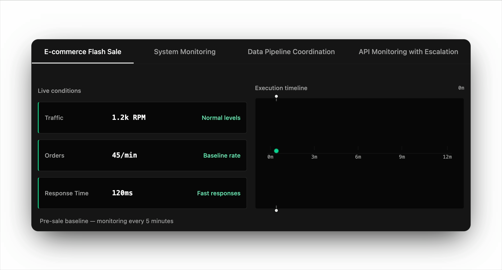

#  Cronicorn

**HTTP jobs that understand their own responses**

Add endpoints, describe what matters in plain English, and the AI reads response bodies to adapt —
 
adjusting frequency, coordinating siblings, and recovering from failures automatically

  

  
   
  <em>Activity surge → AI tightens to 30s + triggers recovery actions → stabilizes → back to baseline</em>

<table align="center"><tr><td>

## Features

- **Adaptive scheduling** — AI adjusts polling frequency based on real response data
- **Plain English descriptions** — no config files, no SDK required
- **Safety constraints** — min/max intervals and TTL-based hints that auto-expire
- **Multi-endpoint coordination** — endpoints are aware of siblings and adapt together
- **Automatic error recovery** — backoff, retry, and recovery actions out of the box
- **Works without AI** — traditional cron and interval scheduling as a fallback

## How It Works

1. **Add an HTTP endpoint** and set a baseline schedule (cron or interval)
2. **Describe what matters** in plain English — thresholds, coordination logic, response structure
3. **AI monitors responses** and adapts frequency, triggers actions, and recovers from failures automatically

## Getting Started

| Path | Link |
|------|------|
| **Web UI** — create and manage jobs visually | [cronicorn.com](https://cronicorn.com) |
| **MCP Server** — manage jobs from Claude, Cursor, or any MCP client | [MCP Server docs](https://docs.cronicorn.com/mcp-server) |
| **API** — integrate programmatically with the REST API | [API Playground](https://cronicorn.com/api/reference) |

</td></tr></table>

  <a href="https://docs.cronicorn.com">Docs</a> ·
  <a href="https://docs.cronicorn.com/mcp-server">MCP Server</a> ·
  <a href="https://cronicorn.com/api/reference">API</a> ·
  <a href="https://docs.cronicorn.com/self-hosting">Self-Host</a> ·
  <a href="https://github.com/weskerllc/cronicorn/issues/new">Support</a>

  
  
  
  

