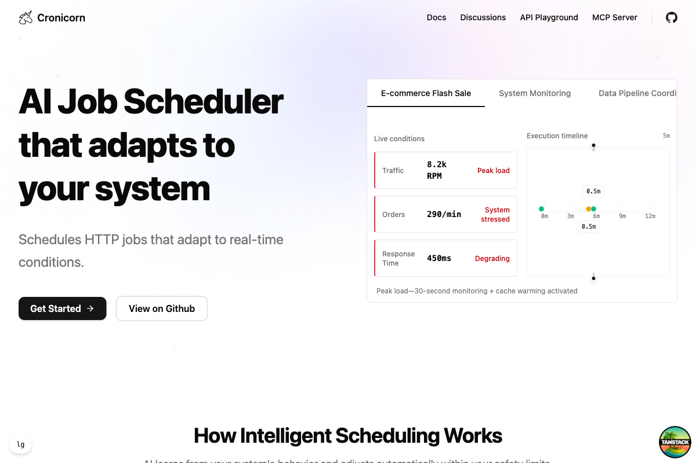

<div align="center">

# Cronicorn

**AI Job Scheduler that adapts to your system**

Schedules HTTP jobs that adapt to real-time conditions.

[](https://github.com/weskerllc/cronicorn)
[](./LICENSE)
[](https://github.com/weskerllc/cronicorn/actions)

[Try Cronicorn](https://app.cronicorn.com) • [Documentation](https://cronicorn.com/docs) • [Self-Host Guide](https://cronicorn.com/docs/technical/system-architecture)

</div>

---

## Why Cronicorn?

Traditional cron jobs run on fixed schedules—whether your pipeline has a backlog, your API is failing, or traffic is surging.

**Cronicorn adapts to real-time conditions:**

- 📉 **Slows down automatically** - Backs off when rate-limited or during stable periods
- 📈 **Speeds up when needed** - Increases frequency during backlogs, failures, or high engagement  
- 🛡️ **Respects your constraints** - Always stays within your configured min/max limits
- 🧠 **Explains every decision** - See why timing changed: "Backlog detected—increasing to 2 minutes"

<div align="center">
  
  <p><em>Live dashboard showing adaptive scheduling in action with real-time condition monitoring</em></p>
</div>

## How It Works

```diff
Traditional Cron:
  */5 * * * * → Runs every 5 minutes regardless of conditions
  
Cronicorn:
  Baseline:  Every 5 minutes
  
  AI adapts based on real-time conditions:
- → 30 seconds when failures detected
  → 5 minutes during normal operation
+ → 15 minutes when stable and healthy
  
  "Rate limit hit—slowing to 30 seconds"
  Always within your configured constraints (30s - 15min)
```

## Get Started

### Try Cronicorn

**[Sign up with GitHub →](https://app.cronicorn.com)**

Create your first adaptive job in 2 minutes. No credit card required.

### Resources

- 📖 **[Documentation](https://cronicorn.com/docs)** - Complete guides and tutorials
- 🤖 **[MCP Server](https://www.npmjs.com/package/@cronicorn/mcp-server)** - AI assistant integration
- 📚 **[API Reference](https://app.cronicorn.com/docs/api)** - REST API documentation

## Key Features

- 🗓️ **Flexible Scheduling** - Cron expressions or simple intervals
- 🤖 **AI Adaptation** - Automatic optimization based on real-time conditions
- 📊 **Complete Visibility** - Detailed run history and error tracking
- 🔒 **Production Ready** - Multi-tenant, distributed locks, reliable execution
- ⚡ **Constraint Protection** - Min/max intervals prevent runaway schedules

## Use Cases

**Data Pipelines** - ETL runs hourly → backlog detected → increases to 15min → clears → back to hourly  
**Content Publishing** - Posts scheduled for 9am → high engagement → AI suggests immediate follow-up  
**Web Scraping** - Requests every 5sec → rate limit warning → slows to 30sec → recovers → resumes

## Support

- 💬 [GitHub Discussions](https://github.com/weskerllc/cronicorn/discussions) - Community support
- 🐛 [GitHub Issues](https://github.com/weskerllc/cronicorn/issues) - Bug reports
- 📖 [Documentation](https://cronicorn.com/docs) - Complete guides

## License

Fair Source License v0.9 - Free to use and self-host. See [LICENSE](./LICENSE) for details.

---

<div align="center">

**[Try Cronicorn](https://app.cronicorn.com)** • **[Documentation](https://cronicorn.com/docs)** • **[API Reference](https://app.cronicorn.com/docs/api)**

Made by developers, for developers

</div>

