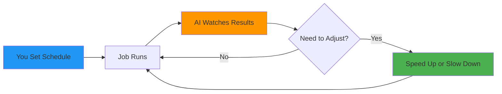

#  Cronicorn

**AI Job Scheduler that adapts to your system**

*Schedules HTTP jobs that adapt to real-time conditions.*

[🚀 Try Cronicorn](https://cronicorn.com) • [📖 Documentation](https://docs.cronicorn.com) • [🎮 API Playground](https://cronicorn.com/api/reference) • [🤖 MCP Server](https://www.npmjs.com/package/@cronicorn/mcp-server)

---

  
   
  <em>Watch it adapt: traffic spikes during a flash sale, monitoring tightens to 30 seconds, then relaxes back to 5 minutes when things calm down</em>

---

<table>
<tr>
<td width="50%" valign="top">

### ⚡ Adapts Automatically
AI tunes job frequency based on real behavior—no manual intervention

### 🛡️ Safe Boundaries
Set min/max limits. AI operates within them. Hints auto-expire

</td>
<td width="50%" valign="top">

### 👁️ Full Transparency
Complete execution history with AI reasoning for every decision

### 📊 Data-Driven
Uses metrics from your endpoints—response times, errors, custom data

</td>
</tr>
</table>

---

## 🚀 Quick Start

### 🤖 Recommended: Use our MCP Server

Let your AI assistant set up your first job in seconds.

  

---

### ☁️ Hosted Platform

**[Sign up with GitHub →](https://cronicorn.com)** - Create your first adaptive job in 2 minutes. No credit card required.

---

### 🐳 Self-Host

**[Self-hosting guide →](https://docs.cronicorn.com/self-hosting)** - Run on your infrastructure with Docker or Node.js.

---

## 🌟 What Makes It Different

**Traditional schedulers** (cron, n8n, Temporal) run jobs on **fixed schedules**.  
**Cronicorn** uses AI to **adapt in real-time** based on what's actually happening.

**[→ See detailed comparison](https://docs.cronicorn.com/competitive-analysis)**

---

## 🎯 Example Use Cases

| What You're Running | How It Adapts | Why It's Better |
|---------------------|---------------|-----------------|
| **Data Pipelines** | Hourly → 15min when backed up → back to hourly | Auto-catchup when you need it |
| **Content Publishing** | Daily at 9am → instant when post goes viral | Strike while the iron's hot |
| **Web Scraping** | Every 5sec → slows when rate-limited → speeds back up | Fast without getting blocked |
| **API Polling** | Every minute → 10sec when data changes → back to 1min | Faster updates when it matters |
| **Health Checks** | Every 5min → 30sec when failing → back to 5min | Catch issues early |
| **Batch Jobs** | Daily → hourly during peak → back to daily | Handle the rush automatically |

**[📖 View More Use Cases →](https://docs.cronicorn.com/use-cases)**

---

## 🏗️ How It Works

### In Plain English

1. **Set a baseline** - "Run this every hour" or "Run at 9am daily"
2. **Job executes** - Cronicorn calls your HTTP endpoint
3. **AI observes** - Response time, errors, custom metrics you return
4. **AI decides** - Should we adjust? Speed up? Slow down?
5. **Auto-adjusts** - Always within your min/max limits

**[🔍 Deep Dive: Architecture →](https://docs.cronicorn.com/technical/system-architecture)**

---

## Ready to Get Started?

**[🚀 Try Cronicorn Free](https://cronicorn.com)** • **[📖 Read the Docs](https://docs.cronicorn.com)** • **[💬 Get Support](https://github.com/weskerllc/cronicorn/issues/new)**

---

*Built with ❤️ for developers who want smarter automation*

