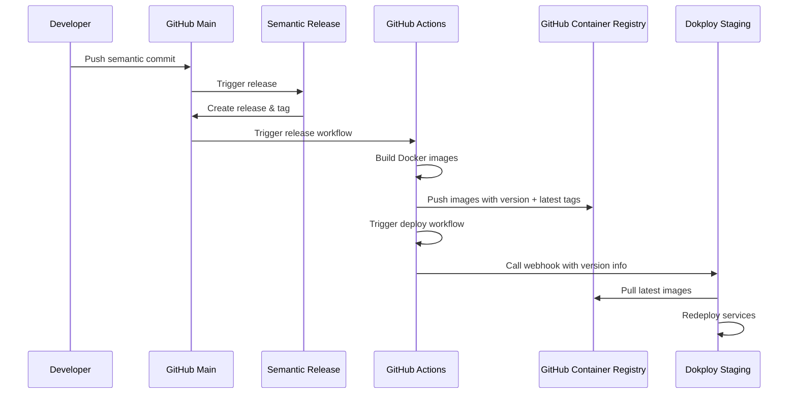
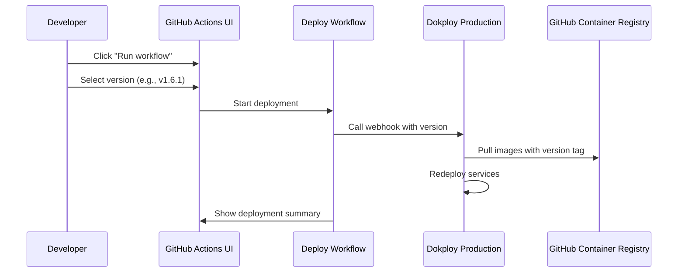
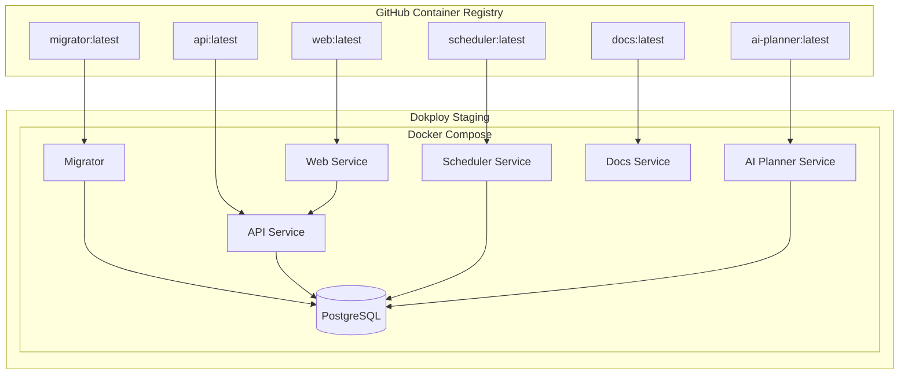
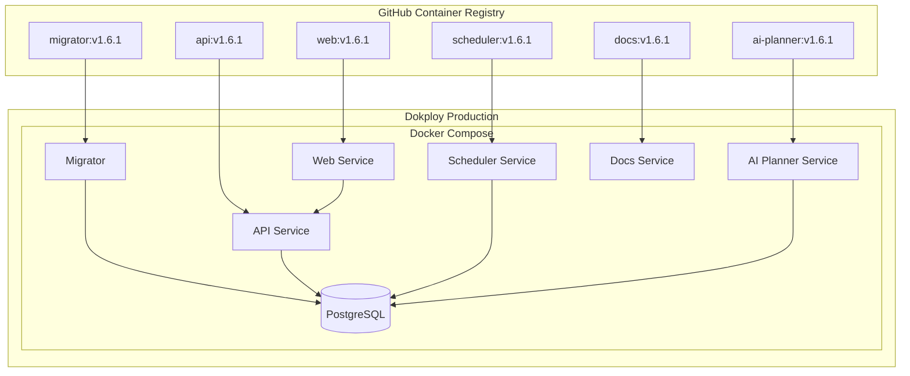
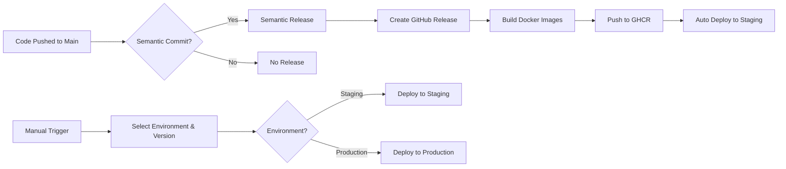
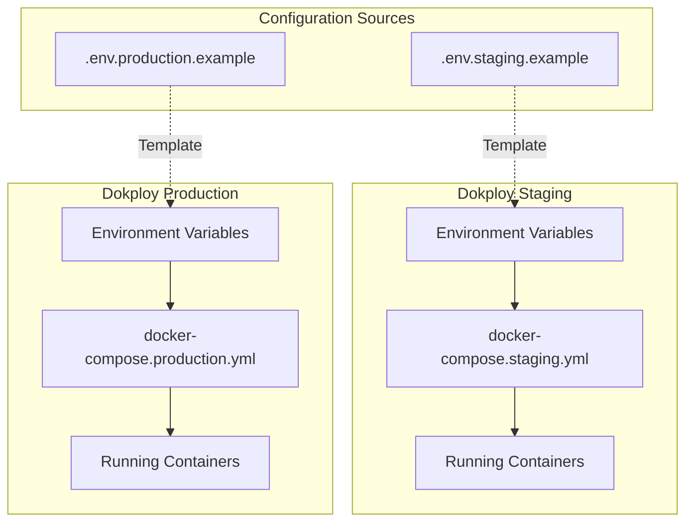
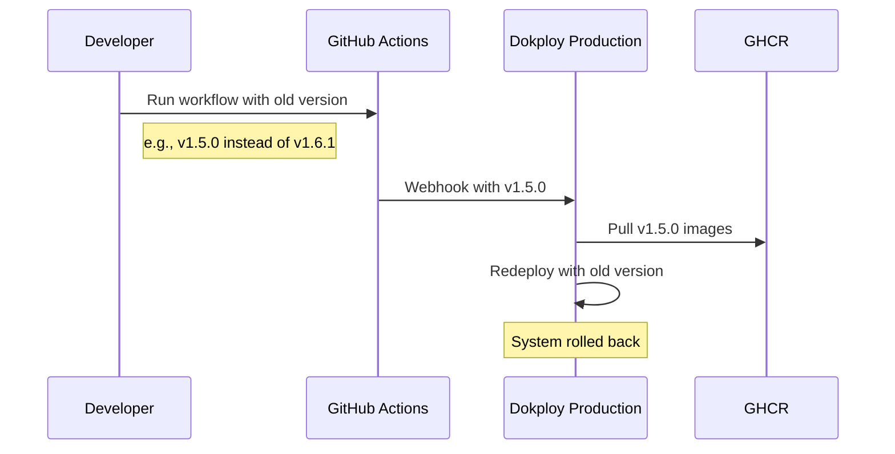
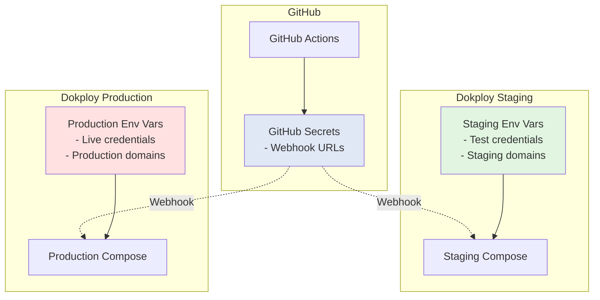

# Deployment Architecture Diagrams

This document contains visual diagrams of the Cronicorn deployment architecture.

## Deployment Flow

### Automatic Staging Deployment

### Manual Production Deployment

## Infrastructure Architecture

### Staging Environment

### Production Environment

## Workflow Triggers

## Environment Variable Flow

## Rollback Process

## Key Differences: Staging vs Production

| Aspect | Staging | Production |
|--------|---------|------------|
| **Deployment Trigger** | Automatic (on release) | Manual (GitHub Actions UI) |
| **Image Tag** | `latest` | Specific version (e.g., `v1.6.1`) |
| **Update Frequency** | Every release | On-demand |
| **Database** | `cronicorn-staging-db` | `cronicorn-production-db` |
| **OAuth App** | Staging GitHub App | Production GitHub App |
| **Stripe** | Test mode | Live mode |
| **Risk Level** | Low (testing) | High (production) |
| **Rollback** | Switch to version tag | Select previous version |

## Security Boundaries

